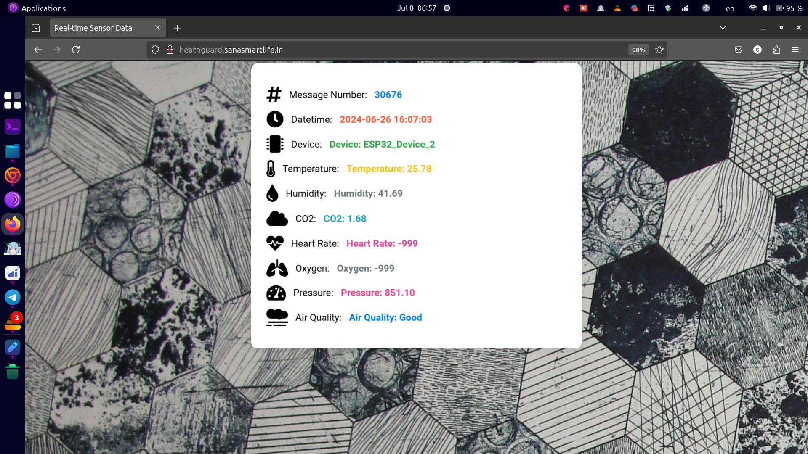
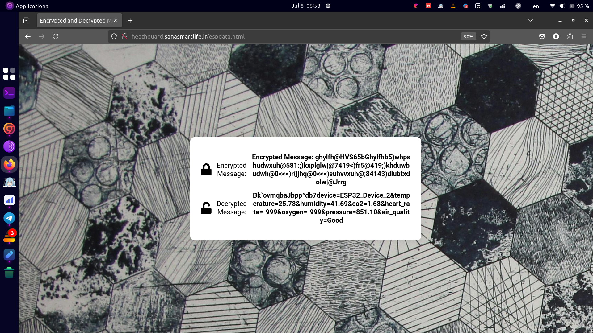

---

# Advanced Environmental and Health Monitoring System with ESP32

This project is an advanced environmental and health monitoring system built with an ESP32 microcontroller. It measures various environmental parameters and human health indicators in real-time, transmitting encrypted data to a remote server via Wi-Fi.

## Features

### Health Monitoring
- **Heart Rate and SpO2 Measurement**: Uses the MAX30105 sensor for accurate heart rate and blood oxygen saturation (SpO2) readings.
- **Finger Detection**: Automatically detects a finger on the sensor to start measurements.

### Environmental Monitoring
- **Temperature, Humidity, and Pressure**: Uses the BME280 sensor for environmental readings.
- **Air Quality**: Monitors CO2 levels with the MQ135 sensor and classifies air quality as "Good", "Fair", "Poor", or "Very Poor".

### LED Indicators
- **Pulse Display**: Heart rate is visually indicated with green LED pulses.
- **Alert System**: Red LEDs blink to indicate when environmental thresholds are exceeded.

### Data Security
- **Data Encryption**: Uses a Caesar cipher for encrypting data before transmission to ensure secure communication.
- **Wi-Fi Connectivity**: Connects to Wi-Fi to send encrypted data to a specified server for remote monitoring.

### Server Communication
- **HTTP POST Requests**: Sends encrypted sensor data to a server for real-time monitoring.
- **Response Handling**: Receives and decrypts responses from the server to ensure data integrity and proper communication.

## Setup and Usage

### Hardware Connections
1. **Sensors**: Connect the MAX30105, BME280, and MQ135 sensors to the ESP32.
2. **LED Strip**: Connect the LED strip to the designated GPIO pin.

### Software Configuration
1. **Wi-Fi Credentials**: Update the Wi-Fi credentials and server details in the Arduino code.
2. **Upload Code**: Use the Arduino IDE to upload the code to your ESP32 board.
3. **Monitor**: Open the Serial Monitor to view real-time data and debug information.

### Server-Side Setup
1. **PHP Script**: Deploy the provided PHP script on your server to handle incoming data. This script decrypts the incoming data, parses it, saves it to a text file and a CSV file, and returns a response to the ESP32.
   ```php
   function decrypt($data) {
       $shift = 3; 
       $decrypted = "";
       for ($i = 0; $i < strlen($data); $i++) {
           $decrypted .= chr(ord($data[$i]) - $shift);
       }
       return $decrypted;
   }

   if ($_SERVER["REQUEST_METHOD"] == "POST") {
       $encryptedData = file_get_contents('php://input');
       $data = decrypt($encryptedData);
       ...
   }
   ```
   
2. **HTML Interface**: Use the included HTML file to display the data in a user-friendly format. The HTML file uses JavaScript to fetch the latest data from the server and update the webpage in real-time.
   ```html
   <script>
       function fetchData() {
           fetch('data.txt')
               .then(response => response.text())
               .then(data => {
                   const lines = data.trim().split('\n');
                   const lastLine = lines[lines.length - 1];
                   const dataArray = lastLine.split(', ');
                   ...
               });
       }
   </script>
   ```

### Arduino Code

The Arduino code collects data from the sensors, processes it, and sends it to the server. It also handles LED indications based on the readings. 

#### Key Sections of the Arduino Code:
- **Wi-Fi Setup**: Connects to the specified Wi-Fi network.
- **Sensor Initialization**: Initializes the MAX30105, BME280, and MQ135 sensors.
- **Data Collection and Encryption**: Collects data from the sensors, encrypts it using a Caesar cipher, and prepares it for transmission.
- **HTTP POST Request**: Sends the encrypted data to the server via an HTTP POST request.

### Running the Project

1. **Prepare the Hardware**: Connect the sensors and LEDs to the ESP32 according to the wiring diagram.
2. **Configure and Upload Arduino Code**:
   - Open the Arduino IDE.
   - Install necessary libraries (`Wire.h`, `MAX30105.h`, `Adafruit_NeoPixel.h`, `Adafruit_BME280.h`, `WiFi.h`, `HTTPClient.h`).
   - Update Wi-Fi credentials and server details in the code.
   - Upload the code to the ESP32.
3. **Setup the Server**:
   - Place the PHP script on your web server.
   - Ensure the server can handle incoming POST requests and has write permissions for the `data.txt` and `data.csv` files.
4. **Run the HTML Interface**:
   - Place the HTML file on your web server.
   - Open the HTML file in a web browser to view real-time data.

## Dependencies

- Arduino IDE
- `Wire.h`
- `MAX30105.h`
- `spo2_algorithm.h`
- `Adafruit_NeoPixel.h`
- `Adafruit_BME280.h`
- `WiFi.h`
- `HTTPClient.h`

## License

This project is licensed under the MIT License. See the LICENSE file for details.

---

